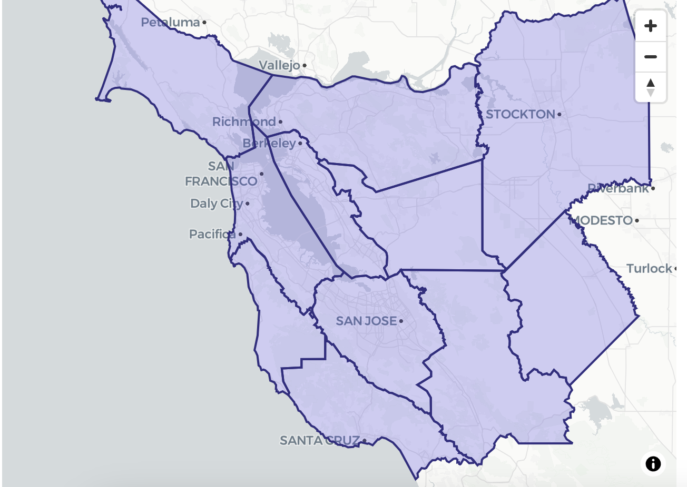

# Dirt.io Soil Explorer



Dirt.io is a full-stack soil data toolkit that helps geospatial stakeholders visualize USDA NRCS soil polygons, load area symbols, and orchestrate large NRCS downloads before pushing the raw ZIP bundles into Google Cloud Storage.

## High-level picture

- **Users**: The primary users are scientists, land managers, or application developers who need accurate soil map units for a location, plus engineers who automate downstream data ingestion.
- **What they do**: Frontend users interact with a Deck.GL/MapLibre map that fetches polygons for a map viewport. Backend services proxy USDA Soil Data Access SQL queries and area symbol lookups while exposing structured data for the UI. The pipeline module safely downloads NRCS ZIP archives and streams them into GCS so bulk processing can begin with confidence.
- **Why this matters**: USDA soils data is rich but can be expensive to query repeatedly. Dirt.io caches area symbol metadata, centralizes FastAPI access, and provides tooling to batch download and stage raw datasets, reducing friction for both interactive exploration and automated ingestion.

## Architecture overview

- **Backend (`backend/`)**: FastAPI application (`soil.py`) handles coordinate-based soil queries and arbitrary SQL posts, `area_symbol_utils.py` flattens the canonical `area-symbols.json`, and `pipelines/nrcs_to_google_cloud_storage.py` asynchronously downloads NRCS manifests into GCS. Tests live in `backend/tests`.
- **Frontend (`web/`)**: Next.js 16 app renders the interactive map (`app/components/Map.tsx`), uses an API client context (`apiClientContext.tsx`) to swap between real and mock clients, and ships Playwright + Storybook suites plus mock helpers in `lib/`.
- **Data assets**: `backend/area-symbols.json` stores the USDA area codes, and the pipelines folder contains a CLI shim (`pipelines/nrcs-to-google-cloud-storage.py`) so the download helpers can run standalone or via imports.

## Developer tutorial

### 1. Prerequisites

- Install Python 3.13 (compatible with `backend/venv`) and Node.js 20+.
- Ensure `pip`, `npm`, and `npx` are available.
- Set up Google Cloud credentials if you plan to run the NRCS pipeline.

### 2. Backend workflow

```bash
cd backend
source ./venv/bin/activate          # use your shell's activate script
pip install -r requirements.txt     # install FastAPI + data dependencies
uvicorn soil:app --reload           # run the API locally
```

Environment variables you can override:

- `AREA_SYMBOLS_PATH`: path to a custom `area-symbols.json`.
- `FRONTEND_ORIGIN`: allowlisted origin for CORS (default `http://localhost:3000`).
- `FRONTEND_ORIGIN` can include the frontend host when running the UI locally.

### 3. Frontend workflow

```bash
cd web
npm install                        # install dependencies (Next.js, Deck.GL, MapLibre, etc.)
npm run dev                         # start the dev server at http://localhost:3000
```

Set `NEXT_PUBLIC_API_MODE=mock` to use the mock API client or point `FASTAPI_BASE_URL` to the running backend. Use `PLAYWRIGHT_BASE_URL` when running Playwright against an external host.

### 4. Pipeline validation

- Create a tiny manifest file with a few NRCS ZIP URLs.
- Set `RUN_NRCSDOWNLOAD_TEST=1` and `NRCSDOWNLOAD_TEST_MANIFEST=/path/to/manifest.txt`.
- Run `python -m pytest backend/tests/test_nrcs_pipeline_download.py`.
- The pipeline module (`pipelines/nrcs_to_google_cloud_storage.py`) can also be invoked directly:

```bash
cd backend
python pipelines/nrcs-to-google-cloud-storage.py path/to/full-manifest.txt
```

It reads URLs, downloads concurrently, unzips the archives, and uploads each file to `soil-raw` GCS bucket (configurable in code).

### 5. Testing commands

- Backend unit tests: `python -m pytest backend/tests`.
- Frontend lint/storybook/playwright: `npm run lint`, `npm run storybook`, and `npx playwright test`.
- Area symbol helper tests: `backend/tests/test_area_symbol_utils.py`.

### 6. Next steps

- Hook the backend into CI using the same `pytest` suite.
- Keep area symbols and manifests in sync with USDA updates by regenerating `backend/area-symbols.json`.
- Extend the frontend with new map overlays by editing `app/components/Map.tsx` and supporting stories/tests.
